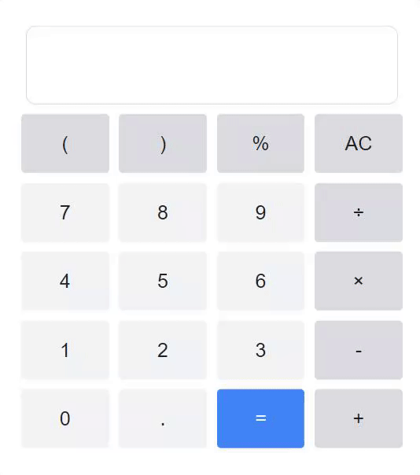

# 30 Days of JavaScript

## Introduction
This repository stores the code for all of my 30 day Days of Javascript(link) projects, where I code small ideas.

#### Day 1
To explore the Javascript language I started with a basic calculator.

### Day 2
